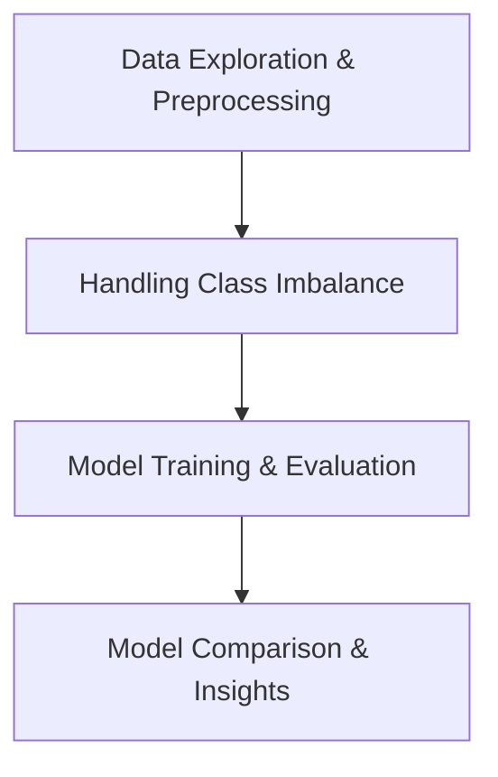

# 🛡️ A Comprehensive Study on Enhancing Classification Performance with Oversampling and Undersampling in Credit Card Fraud Data
Author: Usha
Platform: Entry Elevate
Date: 25-09-2024
Project: Final Capstone Project in Machine Learning from Entry Elevate


Welcome to the repository of my Final Capstone Project in Machine Learning from Entry Elevate. This project showcases an in-depth analysis on improving classification performance for credit card fraud detection using oversampling and undersampling techniques.


Welcome to this repository, which showcases an in-depth analysis on improving classification performance for credit card fraud detection using **oversampling** and **undersampling** techniques.

---


## 📋 Project Overview

In the domain of credit card fraud detection, **class imbalance** is a major challenge. This project focuses on evaluating the performance of machine learning models with **undersampling** and **oversampling (SMOTE)** techniques to improve fraud detection rates. The aim is to ensure models can detect the **minority class (fraud cases)** effectively.

---

## 🗂️ Dataset

The dataset used is the https://data.world/vlad/credit-card-fraud-detection/workspace/file?filename=CC.csv, containing **284,807** transaction records. It includes:

- **Features**: 30 (anonymized `V1-V28`, `Amount`, `Time`)
- **Target Variable**: `Class` (0 = Non-fraud, 1 = Fraud)
- **Highly imbalanced data**: Only 492 fraudulent transactions (minority class).

---

## 🚀 Project Workflow



The workflow includes:
1. **Data Preprocessing**:
   - Feature scaling (excluding 'Time')
   - Removing outliers
   - Train-test split
2. **Class Imbalance Handling**:
   - **Undersampling**: Balancing the dataset by reducing the majority class.
   - **SMOTE (Oversampling)**: Generating synthetic samples for the minority class.
3. **Model Selection**:
   - Logistic Regression
   - Decision Tree
   - Random Forest
   - svm
   - k-Nearest Neighbors
4. **Evaluation Metrics**:
   - Accuracy, Precision, Recall, F1-score
   - Confusion Matrix for detailed analysis.

---

## 📊 Results and Insights

```python
# Example code comparing model performance with undersampling and oversampling
models = ['Logistic Regression', 'Decision Tree', 'Random Forest']
undersample_acc = [0.9700, 1.0000, 1.0000]
oversample_acc = [0.9340,0.9036, 0.9236]

plt.figure(figsize=(10, 6))
x = np.arange(len(models))
bar_width = 0.35
plt.bar(x - bar_width/2, undersample_acc, width=bar_width, label='Undersampling', color='orange')
plt.bar(x + bar_width/2, oversample_acc, width=bar_width, label='Oversampling', color='blue')
plt.xlabel('Models')
plt.ylabel('Accuracy')
plt.title('Model Accuracy: Undersampling vs. Oversampling')
plt.xticks(x, models)
plt.legend()
plt.show()
```

### Key Insights:
- **Undersampling consistently outperforms** oversampling in all models.
- **Random Forest with Undersampling** yields 100% accuracy, but this may indicate overfitting in imbalanced datasets.
- **Logistic Regression** performs better with undersampling, achieving around **97% accuracy**.
- **Oversampling (SMOTE)**, while less effective in this case, helps mitigate overfitting risk but requires tuning.

---

## 🏆 Key Findings

- **Undersampling** achieved higher accuracy, but risks losing critical data.
- **SMOTE** can balance the data without information loss but needs careful application.
- **Random Forest** demonstrated the best performance, but other models should be considered depending on the dataset.

---


## 💡 Key Metrics

The performance of each model is evaluated using the following metrics:

- **Accuracy**
- **Precision**
- **Recall**
- **F1-score**

Example Confusion Matrix:

```python
from sklearn.metrics import confusion_matrix
y_pred = model.predict(X_test)
conf_matrix = confusion_matrix(y_test, y_pred)
print(conf_matrix)
```

---

## 📝 Conclusion

This study demonstrates the importance of handling class imbalance for credit card fraud detection. **Undersampling** provided the best performance in this case, but balancing techniques should be applied carefully, considering the trade-offs between data loss and overfitting. Future work could involve experimenting with more complex models like **XGBoost** and **Gradient Boosting**.

---

